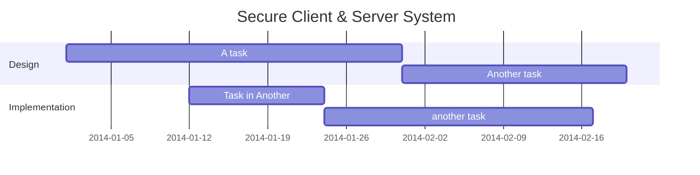

# Operations And Security Manual

## Project Information

> TODO: Clarify and add necessary details.

The project covers building a secure client & server system for a small business. The client is a Raspberry Pi running a custom Linux distribution. The server is a Windows 11 computer. The client and server communicate over a secure network connection.


This report covers the following information (at a minimum):

- Server
- Client computer
    - Windows 11, or
    - Raspberry Pi

## Project Implementation

> TODO: Update this.



## Operations

> TODO: Complete throughout the setup of the devices.

## Security

> TODO: Complete with the security measures in place.

# **Technical Analysis**

## Hardware


## OS

- OS Choice
	We Chose
	
- OS Installation
	1. Insert Micro SD card into the dedicated slot on the Raspbeerry Pi 400
	2. Power on the Pi and 

## Software 

- Installation
	
	1. Install and Update all packages

	```terminal
	sudo apt-get dist-upgrade -y
	```
	
	3. Install Visual Studio Code 

	```terminal
	sudo apt install code -y
	```

	4. Install MariaDB Server

	```terminal
	sudo apt install mariadb-server -y
	```

- Configuration

	1. Install VSCode extensions
		- Database Client JDBC
		- MySQL
		- SQL Tools

	2. MariaDB Setup
		- Access MariaDB via the terminal
		```
		//With root access
		
		mysql
		```
